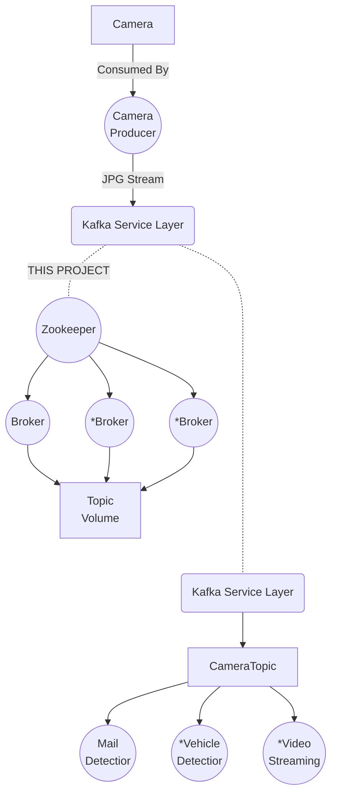
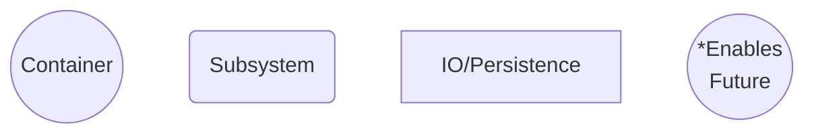

# Kafka Architecture

## Infrastructure Diagram

```mermaid
graph TD
    Camera --> |Consumed By| CameraProducer((Camera<br>Producer))
    CameraProducer --> |JPG Stream| Kafka(Kafka Service Layer)
    Kafka -.- |THIS PROJECT| Zookeeper((Zookeeper))
    Zookeeper --> Broker0((Broker))
    Zookeeper --> Broker1((*Broker))
    Zookeeper --> Broker2((*Broker))
    Broker0 --> TopicVolume[Topic<br>Volume]
    Broker1 --> TopicVolume
    Broker2 --> TopicVolume
    Kafka -....- KafkaServiceLayer(Kafka Service Layer)
    KafkaServiceLayer --> CameraTopic
    CameraTopic --> Mail((Mail<br>Detectior))
    CameraTopic --> Vehicle((*Vehicle<br>Detectior))
    CameraTopic --> Video((*Video<br>Streaming))
```

### Key

```mermaid
graph TD
    Docker((Container))
    Subsystem(Subsystem)
    IO[IO/Persistence]
    Future((*Enables<br>Future))
```
